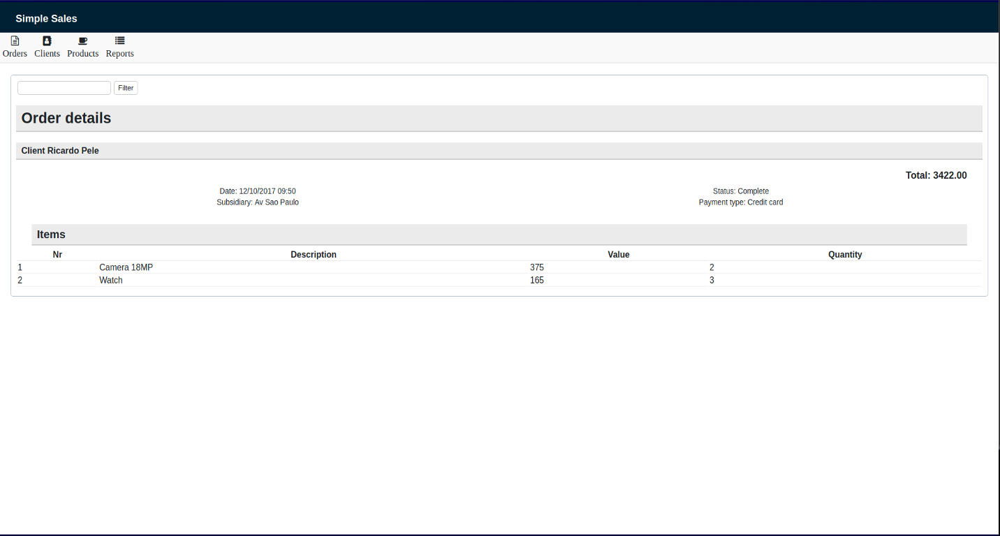

> This project has been migrated to Kotlin and the syntax has changed as well.

> The documentation will be updated soon

# Mockuplan

*Mockuplan* stands for *Mockup Plan Language*.  
This is a text based tool for creating mockups in a fast and simple way.  
Basically you write a text file with a simple specific grammar and the tool generates the result.  

## Overview & Advantages

* Write a simple file like:

```
	---
	---
	
	main
		$ My Page
		label: "  "
		[salvar]
		Radio: ()
		Check: [x]
		email: "@"
		- item
		-item 2
		^Citites^
		subTab
			inner

```

Currently it will generate HTML file (in the future other output formats may be added).

> *But if HTML is already a text file, why would not I just write it directly?*  

* HTML is a more verbose file (it needs to be more detailed for real runnable systems) 
* Ready to use CSS files
	* Mockuplan plans are about having multiple existing CSS configuration (for while there is only one default)
* There are **additional supported features** like:
	* Templating (create files based on an existing structure)
	* States (generate files for different states of the application)


The idea is inspired mainly by PlantUML.  
This is better explained in [References Page](https://github.com/ssricardo/mockuplan/wiki/references), along with other technologies from which this is inspired. Take a look!  

## How to use

Executing Mockuplan is really simple. Just run a code like:

> java -jar mockuplan.jar -i /home/ricardo/myTextFile.mpl  


You can also get help:  

> java -jar mockuplan.jar -help

More details about the [execution and parameters](https://github.com/ssricardo/mockuplan/wiki/how-use) are available at Wiki.

## How to write

The grammar is simple. Currently it refers to only a small subset of HTML elements.  
Learn it in [Grammar page](https://github.com/ssricardo/mockuplan/wiki/grammar) at Wiki.  

### Result



For more information, go to the Wiki Pages. 

-------

There are a lot of work to do yet, here you have some of the items. 

### TODOs

* Improve the grammar
	* It is still fragile, needs to be more tolerant of errors
* Improve documentation
* Ideas:
	* Support images and links? imagens, links?
	* Include **datasources** to populate the pages with sample data
* Document its architechture
* Refactor some parts

# Contribute

Feel free to open issues and help me to find errors.  
Or, even better, become a project contributor!
